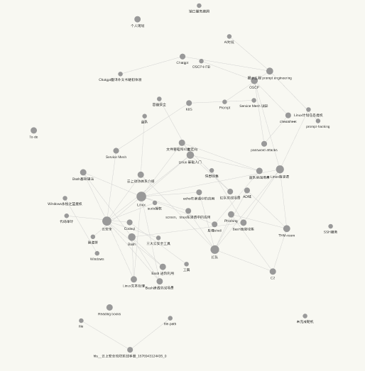

# 初见

之前一直在整理自己的知识库，在尝试过不少笔记软件之后确定了自己的需求：**能自主同步到github存储、支持markdown、支持知识库结构、支持win和Linux系统、功能丰富插件市场好**。

当时选择的是VScode+各种插件支持的方案，在磨合过程中也逐渐形成了自己惯用的插件和自定义配置，但涉及交叉领域的笔记时仍会经常头疼如何分类、放在哪个文件夹更合适、文件夹结构如何调整、分类后如何快速找到。

尽管我已经相当科学的使用了类图书馆索引的方式来构建排序我的文件夹结构，但我经常对分类情况不太满意。当然，这其实算是文件夹体系的一个共同缺陷，所以一直有在找更好的解决方案。

后来接触到了[Logseq](https://github.com/logseq/logseq)，最吸引我的大概就是双链笔记号称的无压分类，以及分类细粒度更高的特点（当然它也比较完善的符合了我的需求）。

到目前已经使用了2个月，也算是过了磨合期，配置和插件选择都相对稳定了下来。所以简单的来讲一讲体验。

# 踩坑

Logseq对我这个一直用惯了传统文件夹体系的人来说，一开始上手还是比较迷茫的。什么是‘块’？什么又是‘页’？为什么没有文件夹和目录？如何才能直观的看到我所有的笔记、确定我之后还可以找回它的位置？

而且由于Logseq的特性，原本markdown的内容直接拖进来会搞的一团糟，在翻阅各类使用说明和前人的使用方式后，我决定把以前的内容放一放，先在logseq写新笔记，用到某些旧笔记内容时再迁移内容，给自己减轻一些迁移压力。

logseq的体系，与以前的不太一样，但如果不需要精细化的使用，实际上也不会做太多的改变。一开始还会纠结，几段连续的内容，到底要不要合并到同一个‘块’方便管理，后来就直接回车，一句话一‘块’都没关系，省时省力，基本也不会想要回来重新梳理合并。一开始会觉得一边记markdown的结构另一边还要关注新‘块’的缩进位置太过麻烦，后来就干脆放弃了纯md的结构，只在想要强调或者需要整理输出时简单用md装饰一下标题。而且如果实在懒，可以完全不用缩进，把所有内容都摊在第一级、把样例、注释等可能更需要隐藏起来的内容放在第二级也没关系（需要迁移的时候再去改缩进就好啦）。

在写笔记的过程中，也在不断的适应着新的体系，在前人的使用习惯上做一些自己的优化。看着现在的内容逐渐增多，还是小有成就感的。

# 优化

logseq本身还在Beta测试阶段，功能丰富度相对欠缺，会有一些bug时不时的冒出来（譬如我经常丢失插件的加载状态需要手动重开插件），好在开发团队和社区十分高效。对我这种热爱折腾的人来说，基本是可以接受的。

顺便介绍一下我目前稳定使用的插件。

1. Heading level shortcuts，快捷键设置md标题级别和格式。对频繁使用md标题的人来说还是值得一用，稍微精简了操作。
2. Doc View Exporter， 生成HTML方便在浏览器上导出为pdf。目前在logseq中使用体验最好的导出pdf插件，美中不足的是对过长的内容生成HTML时会丢掉最下方内容，以及需要在导出前手动将所有折叠块展开，不然也无法导出被折叠的内容，希望后续官方开发团队能支持适配度更好的pdf导出和markdown导出。
3. Todo list，全局收集所有的to-do内容。使用起来非常方便，to-do随便扔在哪里都可以一键完成。
4. Awesome Styler，自定义背景，支持背景图片。一开始我很喜欢用它搞一些花里忽哨的背景，后来逐渐简洁了起来。目前主要用它做一些显示颜色的微调。
5. Bullet Threading，在原版的基础上加深了当前块的结构引导线。方便定位当前块的层级，是我不能没有的东西。
6. Tabs，使用tab展示多个页面，方便切换。是我不能没有的插件，但tab开多了显示会卡，毕竟不是官方功能。
7. Block to page，把整块转成页面。使用频率很高，适合一些随便写写积累多了之后导出成单独页面的需求。
8. TOC Generator，目录生成。目前会将它结合右侧Contents做成一个伪文件夹的目录形式，方便索引。
9. Git，实现内容同步到git项目。是我的必需插件，在按照个人习惯调配好之后非常好的满足了我的同步需求。
10. Char Spacing，盘古之白吧算是。为了美观非常有必要。
11. Randow Notes，笔记随机漫游。在笔记很多了之后，随机漫游是一种很方便整理复习笔记的方式，压力也不会太大。还有一个同款是以块的维度漫游，个人没什么需求。

# 展望

logseq目前对我来说算是很好的完成了知识收纳的目的，缓解了我的分类焦虑。但实际的知识调用、临时查阅能否满足需求，尚未进行高强度的测试（指的是OSCP考试那种现场查并粘贴复制POC的场景）。但再差也不会差到哪里去，logseq的查询功能响应还是挺快的。

可能需要担忧的是从logseq整个迁移出去时，由于logseq并不完全适配md导致需要大量整理格式的问题。但好在目前没什么压力会迫使我考虑再次迁移知识库，即便logseq现在停止更新，当前内容也足够支持我做好知识管理。

据说logseq或者说双链笔记的所谓“海平面下的冰山”是它的unlinked ref，也就是未引用当前page但提及了page标题的内容，意味着潜在的知识关联。虽然我已经有所了解，但它可能还需要一些插件or功能的支持（譬如一些模糊匹配、一些明显的标记、或者一种全新的漫游笔记方式），并且，也需要更好的定义page标题。

至于是否推荐logseq，功能特性、测评、优缺点有很多人做了很多，不再赘述。如果是像我一样有构建知识库需求、又涉及了很多交叉领域知识的分类焦虑，那么尝试一种新的笔记方式未尝不可。